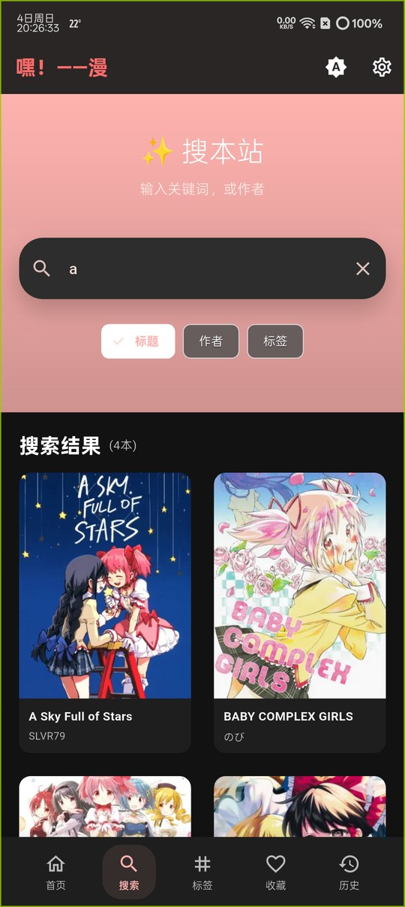
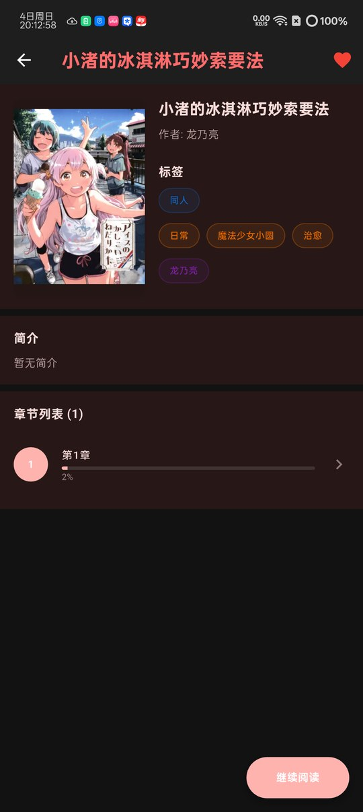
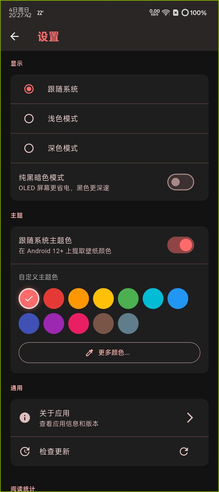

<div align="center">
  

  # 🎯 嘿！——漫

  [](https://flutter.dev)
  [](https://dart.dev)
  [](LICENSE)

</div>

## 📖 项目简介

这是一个完全使用AI辅助AI来开发的Flutter漫画阅读应用，作为配套应用与[漫画网站](https://www.heiman.cc)

**开发工具**:  opencode + deepseek v4 pro/flash


## 📸 应用截图

<div align="center">

### 主界面与搜索



### 标签页与详情页



### 阅读器与设置



</div>

> 截图为 v0.1.27 在 OnePlus PGP110（Android 15）上的深色模式实机截图，构建已启用 R8 压缩并包含
> P0–P3 全部修复。图片存放于 [`docs/screenshots/`](docs/screenshots)，随仓库分发，不依赖外链。

## 🏗️ 项目架构

### 📱 项目结构

```
lib/
├── main.dart                          # 应用入口文件
├── components/                        # 组件目录
│   └── tablet_navigation_drawer.dart  # 平板导航抽屉组件
├── models/                            # 数据模型目录
│   ├── drift_models.dart              # Drift数据库模型定义
│   ├── drift_models.g.dart            # Drift生成的代码
│   └── manga.dart                     # 漫画数据模型
├── services/                          # 服务层目录
│   ├── api_service.dart               # API服务
│   ├── dio_service.dart               # Dio客户端配置
│   ├── drift_reading_progress_manager.dart  # Drift阅读进度管理器
│   ├── favorites_service.dart         # 收藏服务
│   └── reading_progress_service.dart  # 阅读进度服务
├── utils/                             # 工具类目录
│   ├── dual_page_utils.dart           # 双页模式工具类
│   ├── image_cache_manager.dart       # 图片缓存管理器
│   ├── memory_manager_simplified.dart # 内存管理器
│   ├── page_animation_manager.dart    # 页面动画管理器
│   ├── page_transform_state.dart      # 页面变换状态管理
│   ├── parsers.dart                   # 数据解析器
│   ├── reader_gestures.dart           # 阅读器手势处理
│   ├── responsive_layout.dart         # 响应式布局工具
│   ├── smart_preload_manager.dart     # 智能预加载管理器
│   ├── tag_utils.dart                  # 标签工具类
│   └── theme_manager.dart             # 主题管理器
└── widgets/                           # 界面组件目录
    │   ├── about_page.dart                # 关于页面
    │   ├── carousel_widget.dart           # 轮播组件
    │   ├── enhanced_reader_page.dart      # 增强版阅读器页面
    │   ├── favorites_page.dart             # 收藏页面
    │   ├── history_page.dart              # 历史记录页面
    │   ├── loading_animations_simplified.dart  # 加载动画
    │   ├── main_navigation_page.dart      # 主导航页面
    │   ├── manga_detail_page.dart         # 漫画详情页面
    │   ├── manga_list_page.dart           # 漫画列表页面
    │   ├── page_transitions.dart          # 页面过渡动画
    │   ├── pagination_widget.dart         # 分页组件
    │   ├── search_page.dart               # 搜索页面
    │   ├── settings_page.dart             # 设置页面
    │   ├── tablet_main_page.dart          # 平板主页面
    │   ├── tags_page.dart                 # 标签页面
    │   └── reader/                        # 阅读器子组件
    │       ├── reader_controller.dart     # 阅读器状态管理(ChangeNotifier)
    │       ├── reader_controls.dart       # 顶部栏与底部进度条控件
    │       ├── reader_page_renderer.dart  # 单页/双页/过渡页渲染
    │       ├── reader_status_widgets.dart # 加载态/错误态/遮罩
    │       ├── reader_settings_panel.dart # 阅读设置面板
    │       └── reader_chapter_end_page.dart # 章节结尾过渡页
```

### 🔧 技术栈

**核心框架**
- **Flutter SDK**: >=3.44.0
- **Dart SDK**: >=3.12.0

**主要依赖包**
- `dio: ^5.0.0` - HTTP客户端，用于API通信
- `cached_network_image: ^3.3.0` - 网络图片缓存
- `flutter_cache_manager: ^3.4.5` - 图片磁盘缓存管理（设置页缓存统计/清理）
- `dynamic_color: ^1.7.1` - Material You 动态取色
- `url_launcher: ^6.2.2` - URL启动器
- `shared_preferences: ^2.2.2` - 本地存储
- `drift: ^2.29.0` - 数据库ORM
- `sqlite3_flutter_libs: ^0.5.3` - SQLite支持
- `path_provider: ^2.1.1` - 路径提供器
- `path: ^1.8.3` - 路径工具
- `package_info_plus: ^4.2.0` - 包信息获取

**开发依赖**
- `flutter_lints: ^3.0.0` - 代码质量检查
- `build_runner: ^2.4.0` - 代码生成
- `drift_dev: ^2.29.0` - Drift代码生成
- `flutter_launcher_icons: ^0.13.1` - 应用图标生成

## 🚀 快速开始

### 环境要求
- Flutter SDK 3.44.0+
- Dart SDK 3.12.0+

### 安装与运行

```bash
# 克隆项目
git clone https://github.com/xiuusi/heimanmanga-flutter-app.git
cd heimanmanga-flutter-app

# 安装依赖
flutter pub get

# 运行应用
flutter run

# 构建发布版本
flutter build apk --split-per-abi --release
```

### 发布签名

release 包**必须**使用自己的签名密钥，构建脚本不会回退到 Android 调试密钥。
> ⚠️ release 构建需要 `android/key.properties`（以及其中指向的 keystore）；缺失时 `flutter build apk --release` 会直接失败。

首次在新机器上构建 release 包时，需要准备 keystore 与 `android/key.properties`：

```bash
# 1. 生成 keystore（有效期 10000 天）
keytool -genkeypair -v \
  -keystore android/app/heimanmanga-release.jks \
  -storetype PKCS12 -keyalg RSA -keysize 2048 -validity 10000 \
  -alias heimanmanga -storepass "<你的密码>" -keypass "<你的密码>" \
  -dname "CN=heimanmanga, OU=Mobile, O=heimanmanga, L=Unknown, ST=Unknown, C=CN"

# 2. 创建 android/key.properties
cat > android/key.properties <<'EOF'
storePassword=<你的密码>
keyPassword=<你的密码>
keyAlias=heimanmanga
storeFile=heimanmanga-release.jks
EOF
```

`android/key.properties` 与 `*.jks` 均已被 `.gitignore` 忽略，**请务必将 keystore 与密码
备份到仓库之外的安全位置**：一旦丢失，已发布的应用将无法再发布可覆盖安装的更新。
缺少 `key.properties` 时，release 构建会直接失败并给出提示（debug 构建不受影响）。

## 📊 版本信息

- **当前版本**: 0.1.27+3
- **Flutter SDK**: 3.44.0+（当前最低要求）
- **Dart SDK**: 3.12.0+（当前最低要求）

## 📄 许可证

本项目采用 MIT 许可证 - 查看 [LICENSE](LICENSE) 文件了解详情。
